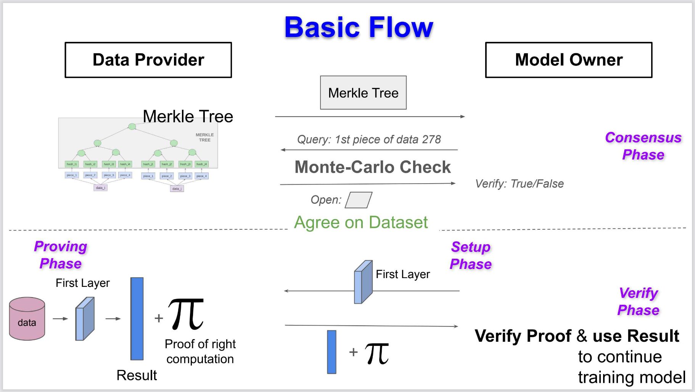
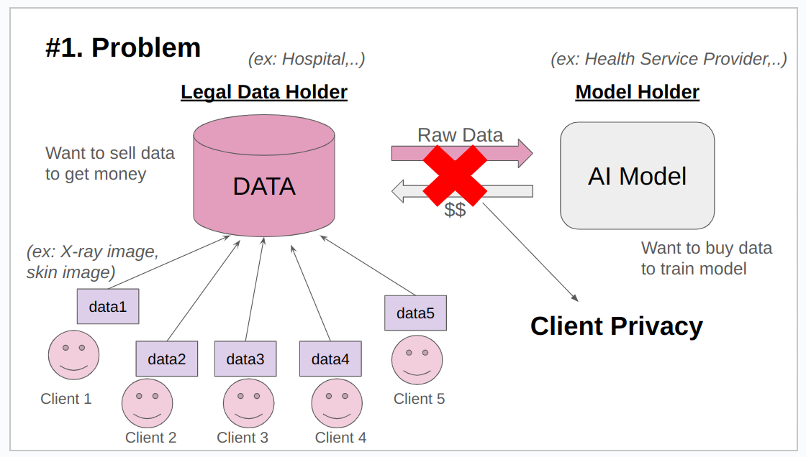
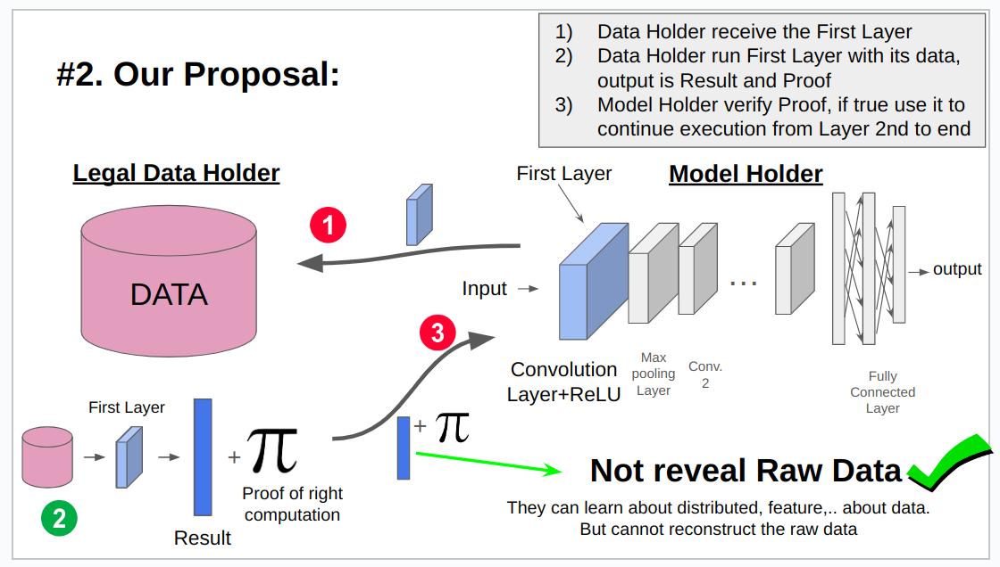
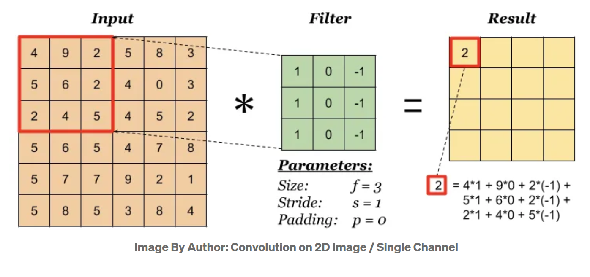
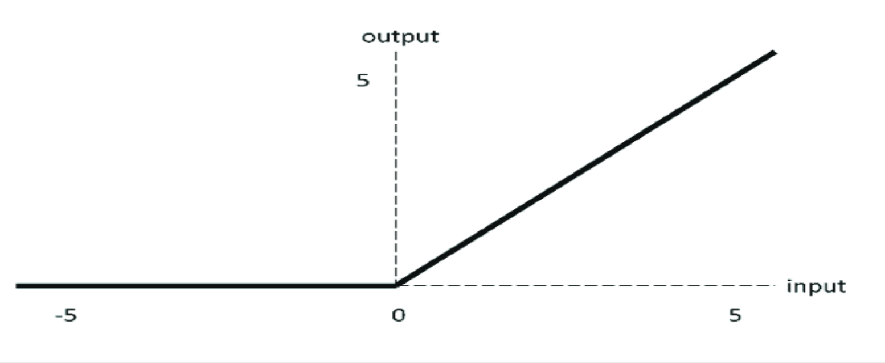
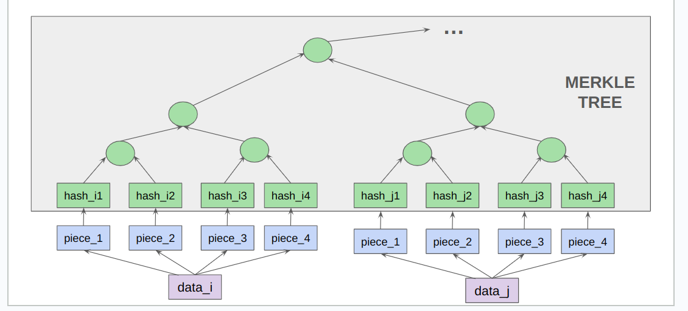
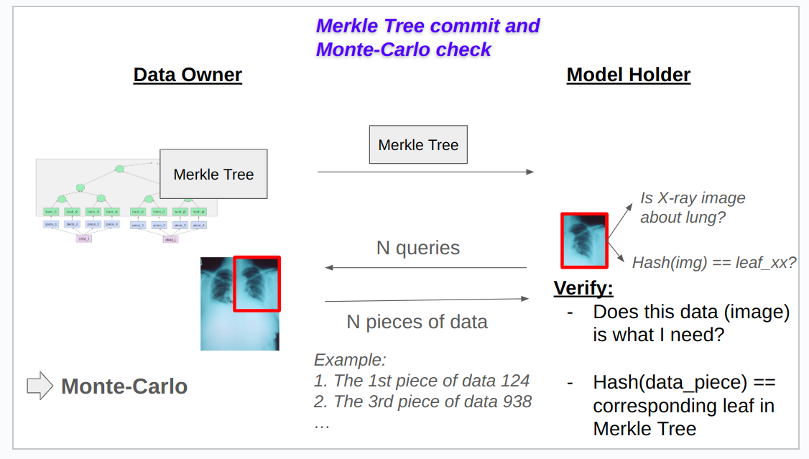
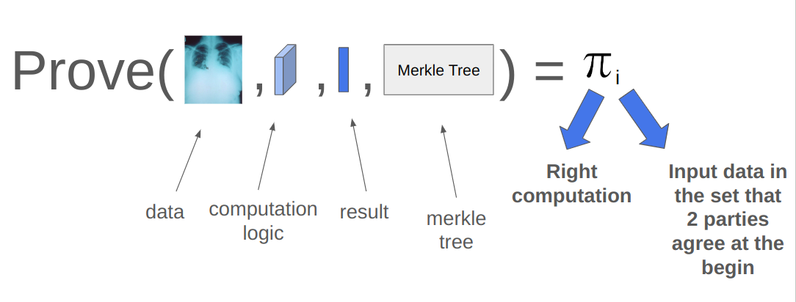

# AI Training Data Selling solution with Privacy Protection (for client)

The **AI Training Data Selling solution with Privacy Protection** is designed to allow **Data Providers** (such as hospitals) to sell data for training AI models while safeguarding client privacy. Our method enables **Data Providers**, who possess client data, to "transform" this data before selling it to **Model Owners** (those who need the data for training their models). This transformation ensures that the true client data is not disclosed, yet remains effective for model training, preserving the client’s privacy.

We establish an interactive protocol between the **Model Owners** and **Data Providers** to reach a consensus on the authenticity of the transformed data. To guarantee that this transformed data is accurate and usable for training, we apply **zero-knowledge proof (ZKP)** techniques. These proofs allow the model owner to verify the integrity of the transformed data without revealing any sensitive client information.

## Team Information

**Project Members**

- Name: Ninh Quoc Bao
  - Discord Username: BaoNinh
  - Devfolio Username: BaoNinh
  - Role: Team Lead, Propose Idea, Implement and Write Document

- Name: Nguyen Minh Nhat
  - Discord Username: nacon304
  - Devfolio Username: nacon304
  - Role: Explore federated learning and zk-SNARK for Machine Learning

- Name: Phan Van Nhat
  - Discord Username: nhatsequoia
  - Devfolio Username: nhatsequoia
  - Role: Explore proof aggregation
  
- Name: Truong Vinh Kien
  - Discord Username: KienTruong
  - Devfolio Username: KienTruong
  - Role: Explore proof aggregation

## Technical Approach

- **Components** (Select all that apply)
  - [ ] Frontend
  - [ ] Backend
  - [ ] Smart Contracts
  - [x] ZK Circuits
  - [x] Machine Learning (ML)

- **Approach**
  - We start by focusing on a Convolutional Neural Network (CNN) model, though this approach is generalizable and could expand to other models in the future.

  - In a CNN, the first layer is typically a **Convolutional Layer**, followed by a **Rectified Linear Unit (ReLU)** layer, which transforms any negative values to zero while retaining positive values. 

  - When data (often images) pass through the **Convolutional Layer** and the **ReLU** activation layer, it transforms into a new form. Reconstructing the original image from this transformed data becomes extremely difficult, if not impossible, as information is lost after passing through ReLU.

  - The core idea is that **Data Providers** will handle the initial step of training the AI model by running the data through the **Convolutional Layer** with the **ReLU** activation layer. They then generate a proof that verifies the correctness of their processing. **Data Providers** send the transformed result along with this proof to the **Model Owner**. The **Model Owner** can then verify the proof, and if it’s valid, use the result to continue training the model as usual.

  - The main concept here is to delegate the initial step of model training to **Data Providers**. They handle this step with the original data and provide a proof of the correct process. The **Model Owner** then receives the verified result and continues with the remaining steps of the training. This method effectively splits the training process into two parts, allowing smooth model training without compromising client privacy.

  - However, the challenge here is ensuring that the **Model Owner** can trust that **Data Providers** are using the correct data — specifically, the data that both parties agreed upon. To address this, a protocol must be established at the outset to create consensus on the dataset used by the **Data Providers**. The proof generated by **Data Providers** must confirm that the data they processed is indeed part of this agreed-upon dataset.
    - To achieve this, we apply **Merkle Tree** and **Monte Carlo** methods. The **Merkle Tree** structure helps both parties securely verify that individual data points belong to the original dataset without revealing its entirety, while **Monte Carlo** methods provide statistical confidence in the proof’s accuracy. We will outline these methods in more detail in the following sections.

  - To improve efficiency, **Data Providers** can apply *aggregation/folding* techniques to combine multiple proofs (for several images) into a single proof, or a small number of proofs as desired. This approach reduces the verification workload for the **Model Owner** by allowing multiple data items to be verified simultaneously, optimizing the verification process without compromising accuracy. 

  

- **Technical Components**
  - **Consensus Phase**: An iterative protocol that utilizes **Merkle Tree** and **Monte Carlo** methods to establish consensus on the dataset used by the **Data Providers**. This ensures that both parties agree on the exact data being processed without revealing the entire dataset.
  
  - **Setup Phase**: Both parties collaboratively set up the global parameters and necessary circuits required for generating and verifying proofs. This foundational setup is crucial for maintaining the integrity and security of the proof generation and verification processes.
  
  - **Proof Generation**: **Data Providers** process their data through the Convolutional Layer and ReLU activation function. After processing, they generate a proof that verifies the correctness of the execution. Additionally, this proof confirms that the data used belongs to the previously agreed-upon dataset, ensuring transparency and trustworthiness in the data handling.
  
  - **Verification**: The **Model Owner** verifies the provided proof to ensure its validity. If the proof is confirmed to be true, the **Model Owner** extracts the result from the proof—since the result is public—and proceeds to continue training the model as usual. This verification step guarantees that only correctly processed and agreed-upon data is used in the training process, thereby maintaining the model's integrity and the client's data privacy.
 
## Idea:

### Problem want to solve:

- **Data Holder** (e.g., a hospital) possesses sensitive client data.
- **Model Owner** (e.g., a health service provider) seeks to use this data to train their model.

**Problem**: The Data Holder cannot directly sell or share this data with the Model Owner, as doing so would compromise client privacy.

### Our Proposal: 

- A CNN model consists of multiple layers, with the first typically being a **Convolutional Layer** followed by a **ReLU** activation. When input data (such as images) passes through this layer, it becomes almost impossible to reconstruct the original image from the output.

  - This is due to the difficulty of inverting the convolution process. In a Convolutional Layer, a filter is applied to the image through a series of dot products with overlapping sections of the input matrix, sliding across the image until all regions are covered.
  
    
  
  - Even with knowledge of the filter parameters and the output, determining the original input is highly challenging. Convolution introduces transformations that, without the exact positional context, are computationally hard to reverse.
  
  - Additionally, ReLU causes information loss, as it converts all negative values in the output to zero. This step obscures the original values that were less than zero, making it impossible to accurately retrieve the convolutional layer's output before ReLU was applied.
    

- We leverage this characteristic to enhance the privacy of client data. Once the output of the Convolutional Layer combined with ReLU is obtained, the Model Owner cannot reconstruct the original image. While this approach does not entirely eliminate privacy risks—since adversaries may still glean some information from the output—it does not undermine the objectives of our proposal. The inability to reverse-engineer the original data significantly mitigates potential privacy concerns, aligning with our goal of securely utilizing client data for model training.

**FLOW:**

- **Step 1**: The **Model Owner** sends the structure of the first layer, along with the weights and biases for that layer, to the **Data Provider/Data Holder**.

- **Step 2**: The **Data Provider/Data Holder** runs the **Convolutional Layer** with the **ReLU** activation function using the weights and biases provided by the **Model Owner**. They generate a proof that demonstrates they have processed the data correctly with the specified parameters and achieved the resulting output.

- **Step 3**: The **Data Provider/Data Holder** sends the processed result and the corresponding proof back to the **Model Owner**. The **Model Owner** verifies the proof; if it is valid, they use the result to continue training the model by passing this output as the input to the second layer.

- **Step 4**: These steps can be repeated for each training epoch. After completing one epoch, the **Model Owner** performs backpropagation to calculate new weights. They then send these updated weights back to the **Data Provider/Data Holder** to continue generating results for the subsequent training epochs.

### A new problem arisen

The above method is beneficial for the **Data Owner/Holder** and their clients, but it poses risks for the **Model Owner**. The **Model Owner** faces the uncertainty of whether they will receive the correct results. While they can be confident that the **Data Owner/Holder** has performed the necessary calculations on the data, they cannot verify whether the data used is what they actually need. For instance, if the **Model Owner** intends to purchase X-ray images for training their model but the **Data Owner/Holder** uses landscape images instead, the **Model Owner** has no means to confirm this discrepancy. This situation forces the **Model Owner** to trust that the **Data Owner/Holder** is using the correct data, which is neither fair nor aligned with the objectives of web3.

Currently, federated learning operates under a similar trust model, relying on the assumption that **Data Owners/Holders** are using appropriate data. 

To address this challenge, we must design a protocol from the beginning that requires **Data Owners/Holders** to commit to the dataset they will use, ensuring that it meets the **Model Owner's** requirements. This can be achieved by having both parties reach consensus on the dataset before any processing occurs. Subsequently, during the processing phase, the **Data Owner/Holder** must use only the committed data from this agreed-upon dataset to perform calculations and provide proof of their usage. This approach creates accountability and fosters trust between the parties involved, ensuring that the data utilized aligns with the **Model Owner's** needs.

**SOLUTION**

- **Step 1**: The **Data Owner/Holder** divides each image into four pieces (or more) and creates a hash for each piece to construct a **Merkle Tree**, which is then sent to the **Model Owner**.

  - The decision to divide each image into four pieces allows for selective disclosure during later verification steps, minimizing privacy risks. Instead of revealing the entire image, only one-fourth of the data will be opened for inspection.

  - Instead of hashing each piece, a **zk-friendly** function can be employed that makes it difficult to find collisions or second pre-images. In this implementation, we use the mean of the results from each piece after processing through another convolutional layer, which is collaboratively constructed by both parties.

  - 

- **Step 2**: The **Model Owner** performs a Monte Carlo check by sending N queries (e.g., requesting the 1st piece of data, the 3rd piece of data, etc.) to the **Data Owner/Holder**. The **Data Owner** must then open these specified pieces of data for verification.

- **Step 3**: The **Model Owner** verifies the following:
  - Is the opened data (image) what I need?
  - Does the opened data correspond to the correct position in the Merkle Tree? (This involves recalculating the hash for the leaf node and comparing it to the original hash in the tree.)

### Proof Generation

At this stage, the **Data Owner/Holder** must generate a proof to demonstrate two key aspects:

1. **Correct Calculation**: The proof must validate that the **Data Owner/Holder** correctly processed the input data through the specified operations (e.g., passing through the Convolutional Layer and ReLU activation) to produce the result that was shared with the **Model Owner**.

2. **Input Data Membership**: The proof must confirm that the input data belongs to the Merkle Tree at the specified position (xxx). This ensures that the data used in the calculations is indeed part of the agreed-upon dataset, thereby aligning with the **Model Owner's** requirements.

### Efficient Verification and Transfers

For efficient verification (for **Model Owner**) and transfer, **Data Owner** can apply *aggregation/folding* technique to combine multiple proofs to one proof.

## Sponsors (if applicable)

If you are applying for a sponsor project idea or grant, select the sponsors below.

- [ ] Push Protocol
- [ ] Polygon
- [ ] Chainlink
- [ ] Brevis
- [ ] Orbiter
- [ ] ZKM
- [x] Nethermind
- [x] PSE
- [ ] AltLayer

## What do you plan to achieve with your project?

So far, my project has successfully reached the stage of a complete proof of concept (POC), demonstrating the functionality with a single image. The aggregation feature has not yet been implemented.

Moving forward, we aim to:

- Complete the implementation of the aggregation technique.
- Provide a generic codebase (API or CLI) for Convolutional Neural Networks (CNNs).
- Extend the framework to accommodate other model architectures beyond CNNs.
- Conduct benchmarking to evaluate performance and effectiveness. 

The source code and idea is open for anyone want to contribute,use and develop.

## Lessons Learned (For Submission)

The most important takeaways from our project are:

- **Merkle Tree** + **Monte Carlo Check Protocol**: This combination significantly reduces the risk for the **Model Owner** by ensuring that the data used in calculations is legitimate and corresponds to the agreed-upon dataset. This innovative approach enhances trust and security, addressing a crucial gap in current methodologies.

- **Minimal Delegated Computation**: By limiting the delegated computation to just the first layer of the model, we achieve two essential objectives: efficient proof generation and robust privacy protection. This strategy not only streamlines the process but also safeguards client data, making it a pivotal aspect of our design.

## Project Links (For Submission)

We use **ezkl** for generate proof, **ezkl** is a developer-friendly system for verifiable AI and analytics. It provide enough tools that we need. 

- EZKL: https://github.com/zkonduit/ezkl
- EZKL gg-colab demo: https://colab.research.google.com/github/zkonduit/ezkl/blob/main/examples/notebooks/simple_demo_public_network_output.ipynb
- EZKL docs: https://docs.ezkl.xyz/
- ONNX supporting operators: https://onnx.ai/onnx/operators/ 

## Implementation details and Source code:

### FLOW

1. **Import Libraries & Define Paths**: Start by importing the necessary libraries and defining the file paths for saving generated files.

2. **Create Merkle Tree**:
   - Both parties generate two random numbers, which are combined to create a seed for a pseudo-random number generator.
   - Using this seed, they generate random weights and biases for the "commit" convolutional layer, which is used to generate commitment data.
   - The **Data Owner** then processes each image segment through this commit convolutional layer to produce the commitment values, which are organized into a Merkle Tree.

3. **Monte Carlo Check**:
   - The **Model Owner** performs a Monte Carlo check by sending a series of random queries for specific data pieces. The **Data Owner** must reveal the requested pieces, allowing the **Model Owner** to verify that the data matches the Merkle Tree commitments.

4. **Define Circuit Structure & Generate ONNX File**:
   - Define the structure of the circuit, which reflects the CNN's operations, and generate an ONNX file that serves as a template for the proof generation process.

5. **Setup Phase**:
   - Generate the necessary cryptographic parameters, including the proving key, verification key, structured reference string (SRS), and other elements required for the proof system.

6. **Proving Phase**:
   - The **Data Owner** uses the agreed-upon data and circuit structure to generate a proof, demonstrating correct calculations while ensuring privacy.

7. **Verification Phase**:
   - The **Model Owner** verifies the received proof against the verification key to confirm that the operations were performed correctly using the agreed-upon data.

8. **Extract Data from Proof & Continue Training**:
   - Once verified, the **Model Owner** extracts the intermediate output data from the proof and uses it as input for the next layers in the model, allowing training to continue without compromising privacy.

Because we just demo for single proof, so that we don't need to create the Merkle Tree, it just a 4 value.

We put our demo on folder `notebook`, it contain 3 ipynb files:
- `Demo-Flow-of-both-Prover-and-Verifier.ipynb` : it demonstrate the flow in one file 
- `Data-Owner.ipynb` : if use want to run each party seperate, use it for Data-Owner role
- `Model-Owner.ipynb` : if use want to run each party seperate, use it for Model-Owner role

## Video Demo (For Submission)

Please provide a link to a video demo of your project. The demo should be no longer than 5 minutes and should include a brief intro to your team and your project.