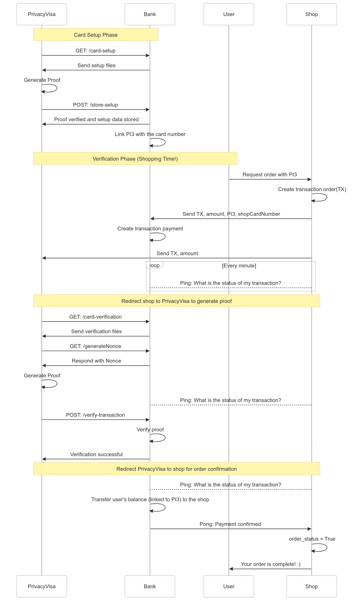
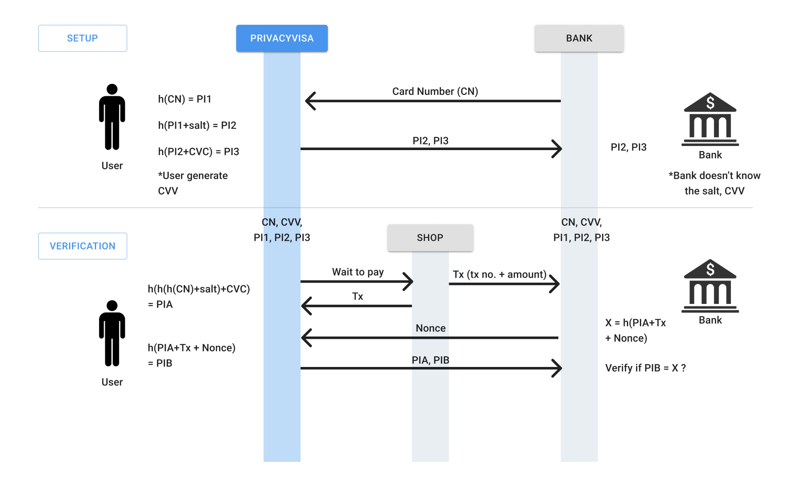

# PrivacyVisa

## Overview

Problem: Traditionally, cardholders must trust merchants to protect sensitive card information, including card numbers and CVV codes. However, many shops don’t use secure payment gateways, creating potential vulnerabilities.

Solution: PrivacyVisa provides a secure alternative that prevents merchants from accessing or storing sensitive card information (like card numbers and CVVs) by utilizing zero-knowledge proofs (ZKPs). This enables transactions without exposing cardholder details, ensuring user privacy and reducing fraud risks.

## How It Works

    
1. Card Generation: Users generate a virtual credit card through PrivacyVisa, establishing a secure link with their bank.

2. Shopping: When a user makes a purchase, the shop sends the necessary transaction information to both the bank and PrivacyVisa.

3. Proof Generation: PrivacyVisa generates a ZKP that verifies the transaction’s authenticity without exposing the card number or CVV and sends it to the bank for verification.

4. Verification: The bank verifies the proof and informs the shop, which then completes the transaction with the user.

Core Technology
*    Circom: Builds circuits for Zero-Knowledge Proofs, allowing PrivacyVisa to generate secure proofs without revealing any sensitive information.
*    SnarkJS: Compiles circuits, generates proofs, and efficiently verifies them. 

Next Steps

*    PrivacyVisa Wallet: Develop a wallet to store salt and secrets securely for enhanced future protection.
*    On-Chain Verifier: Build an on-chain verifier to support decentralized, transparent payment verification.
*    zkVM Migration: Transition to a flexible zkVM, enhancing scalability with recursive proof support for complex computations.
*    Proof Without Trusted Setup: Utilize Risc0 to support a wide range of zkVisa use cases without the need for a trusted setup.

## For ZK part



Here’s a simplified, plain-text explanation of the setup and verification process for PrivacyVisa.

### Setup Phase

  
Card Setup: When a user sets up their credit card with PrivacyVisa, the bank securely shares the user’s card number (CN) with PrivacyVisa.
Hash Generation: The user then generates three key “public inputs” (PIs) based on their card information:
*    PI1: A hashed version of the card number.
*    PI2: Another hash, this time of PI1 combined with a unique “salt” (a random value added for extra security).
*    PI3: A final hash of PI2 combined with the card’s CVV (the card’s security code).
Secure Sharing: The user sends PI2 and PI3 (but not the actual card number or CVV) to the bank. This setup allows PrivacyVisa to create a secure reference to the card without sharing sensitive details.
### Verification Phase (when making a payment)

    
Initiate Payment: When the user wants to make a purchase, the shop sends the transaction details (TX number and amount) to both the bank and the user.

Nonce Generation: The bank generates a “nonce” (a one-time, random value) and sends it to the user. This nonce is unique to the transaction, preventing replay attacks.

Generate Proofs: The user combines the card number, salt, CVV, and transaction data to create two new values, PIA and PIB:

*   PIA: A hashed combination of PI1 (card number hash), salt, and CVV.
*   PIB: A hash of PIA combined with the transaction number and nonce.
Verification by Bank: The user sends both PIA and PIB to the bank.
*   The bank then verifies PIB by generating its own version, X, which is calculated as a hash of PIA + transaction + nonce.
*   If PIB matches X, the bank confirms the payment as authentic and completes the transaction.

This system uses zero-knowledge proofs (ZKPs) to confirm the user’s identity and payment information without revealing their actual card number or CVV to the shop, thereby securing sensitive information.

# Project Setup

This project includes three main services: Bank, Shop, and Privacy Visa. Follow the instructions below to set up and run each service.

---

## Bank Service

To start the Bank service:

1. Navigate to the `bank` directory:
   ```bash
   cd bank
2. Run the following command to start the service:
    ```bash
    node ./index.js
## Shop Service

The Shop service has both back-end and front-end components. Set up each component as follows.

### Back-end

1. Navigate to the shop directory:
    ```bash
    cd shop
2. Run the following command to start the back-end service:
    ```bash
    node ./index.js
### Front-end
1. Navigate to the front directory within shop:
    ```bash
    cd front
2. Install the required dependencies:
    ```bash
    npm install
3. Start the front-end service:
    ```bash
    npm start
## Privacy Visa Service

To start the Privacy Visa service:
1. Navigate to the privacy_visa/front directory:
    ```bash
    cd privacy_visa/front
2. Install the required dependencies:
    ```bash
    npm install
3. Start the front-end service:
    ```bash
    npm start
### Mock Card Setup 

curl

```bash
curl --location 'http://localhost:4000/store-setup' \
--header 'Content-Type: application/json' \
--data '{
    "proof": {
        "pi_a": [
            "6407957346676147129561024712149214386294828348958778591215911884147390737359",
            "19042582806673145003621603123808892374849801361981360754773432336750555929129",
            "1"
        ],
        "pi_b": [
            [
                "19453614914330786658378789676442907288470576016412896965881823939581523555688",
                "16698749097010510229193444855622948445420927359488750369418289291820886077882"
            ],
            [
                "17202455011486457261634996561563605249476690520268411851650988328884162342775",
                "13478988692123643820366741480659905193552238068487352295484164214590762361325"
            ],
            [
                "1",
                "0"
            ]
        ],
        "pi_c": [
            "21660831034479347413327491351473536256574626063129867167917646512036447882688",
            "6206391789800621225909398948361011529112052220521107897472459356594271044331",
            "1"
        ],
        "protocol": "groth16",
        "curve": "bn128"
    },
    "publicSignals": [
        "15588474948339038120051883302888462299793590286856631237429178316026962758478",
        "9308090584616674282342942539084248126853526892431147539300436350638522588197"
    ],
    "card_number": "1234567890123456"
}'
