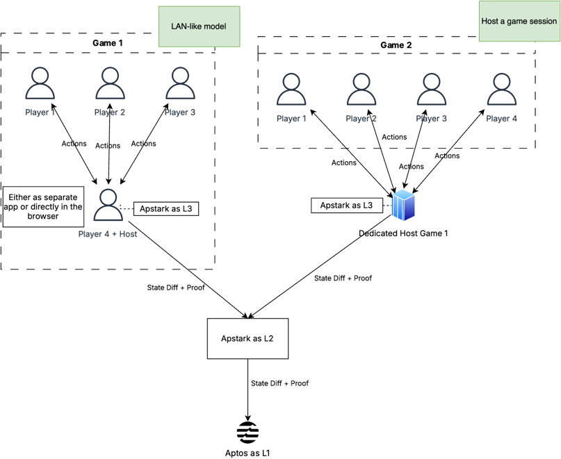

# Apstark

Apstark is a Layer 2 ZK-Rollup blockchain built on top of the Aptos network.

[Click here for further details](https://github.com/sota-zk-labs/apstark)

## Team Information

**Project Members**

- Name: Steve Nguyen
    - Discord Username: zk_steve
    - Devfolio Username: steve_zk
    - Role: Lead
- Name: Draply Do
    - Discord Username: draply
    - Devfolio Username: draply
    - Role: Dev
- Name: Duoc Bui
    - Discord Username: hduoc2003
    - Devfolio Username: hduoc2003
    - Role: Dev
- Name: Hai(Ægir) Trieu
    - Discord Username: 0x5ea000000
    - Devfolio Username: 0x5ea000000
    - Role: Dev
- Name: Andrew Tran
    - Discord Username: Andrew Tran
    - Devfolio Username: Andrew Tran
    - Role: Dev

## Technical Approach

- **Components** (Select all that apply)
    - [ ] Frontend
    - [x] Backend
    - [x] Smart Contracts
    - [x] ZK Circuits
    - [ ] Machine Learning (ML)

- High-level outline of the main technical components, tech you used and approaches used in the project.
    - Aptos: Layer 1.
    - Madara - Starknet's tech stack: Layer 2.

## Sponsors (if applicable)

If you are applying for a sponsor project idea or grant, select the sponsors below.

- [ ] Push Protocol
- [ ] Polygon
- [ ] Chainlink
- [ ] Brevis
- [ ] Orbiter
- [ ] ZKM
- [ ] Nethermind
- [ ] PSE
- [ ] AltLayer

## What do you plan to achieve with your project?

In the future, after completing our Layer 2, we plan to build an aggregation layer to connect Apstark with Starknet. This would allow
users to seamlessly interact with both the Aptos and Ethereum networks through our Layer 2—similar to what Polygon’s aggregation layer
aims to achieve.

We also envision Apstark as a gaming-focused chain or app chain template. This approach would allow Apstark to support separate, small
L3 networks for individual games or game sessions, depending on the use case. For example:

- In a LAN-like model, a player can act as the host, running Apstark on their device (either in-browser via WASM or as a separate app),
  while other players connect to them. The game session's interactions are compiled into a ZK proof by the host and then synced with
  Apstark L2.
- Alternatively, a third-party can host Apstark as a “game server,” enabling players to connect to a separate chain that syncs all game
  data to Apstark L2 via ZK.

## Lessons Learned (For Submission)

We learned how to build a Layer 2 ZK-Rollup from the ground up. This is a large project, so we had to understand how zk-STARKs
function, how to implement them in a smart contract, and tackle various engineering challenges along the way. These challenges included
optimizing for performance, ensuring security and data availability, and managing the complexities of integrating multiple
technologies. This experience has not only deepened our technical knowledge but also sharpened our skills in designing and building
scalable, secure blockchain solutions.

## Project Links (For Submission)

https://github.com/sota-zk-labs/apstark

## Video Demo (For Submission)

https://youtu.be/OUEnUfrKgJA