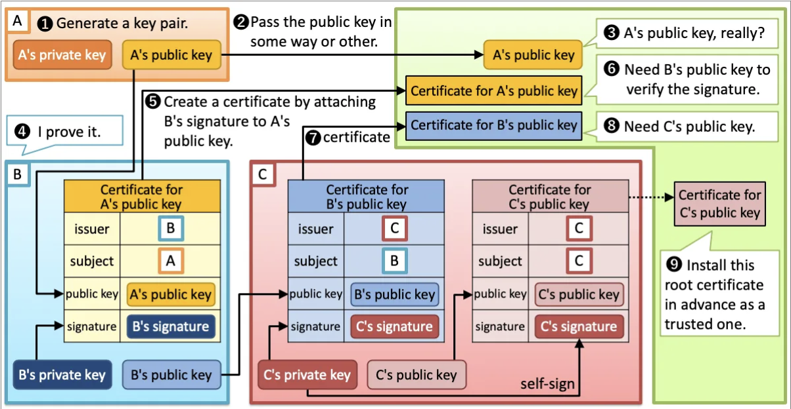
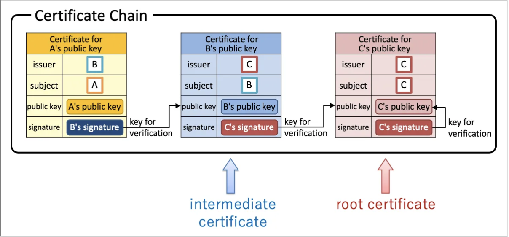
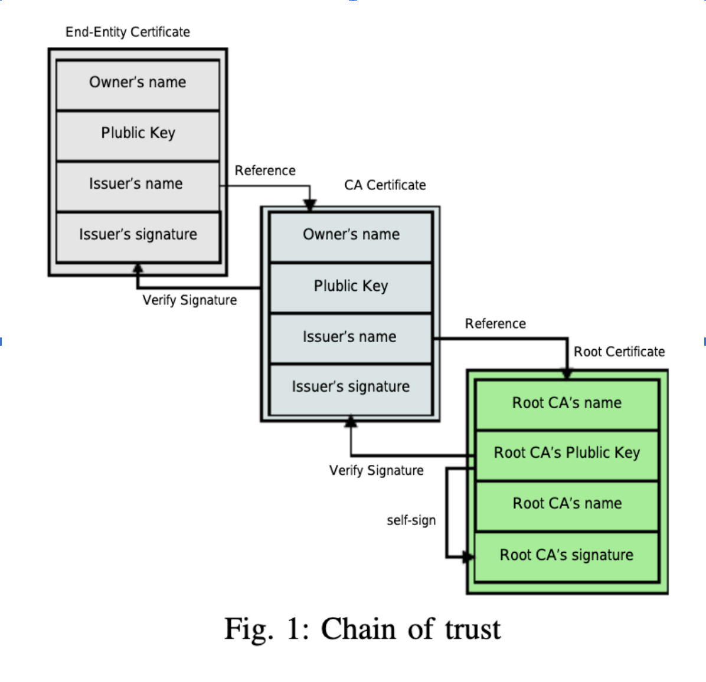
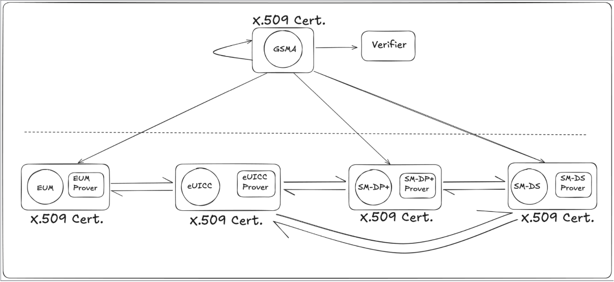

# X.509 certificates and Chain of Trust

## ASN.1

* Standard Interface Description Language (IDL) for defining data structures that can be serialized and deserialized in a cross-platform way.  
* Used to define a large number of protocols.   
* Most extensive uses: telecommunications, cryptography, and biometrics.  
* X.509 certificate is one of the standards defined in the ASN.1 module under the X.500 directory services.

## X.509 Certificates

[Source](https://darutk.medium.com/illustrated-x-509-certificate-84aece2c5c2e)

* Mostly used in TLS (Transport Layer Security)  
* Allows all parties to access the details of a user’s X.509 certificate. Even normal users on a web browser can do so by clicking the padlock next to a page’s URL in the address bar.  
* 3 types of certificates: Root certificate, Intermediate certificate, and End-entity certificate.

[Source](https://darutk.medium.com/illustrated-x-509-certificate-84aece2c5c2e)

Root certificate: 

* Primary certificate of trust, used by CA to sign all certificates  
* Must be the final certificate in the trust store  
    
  Intermediate certificate:  
* X.509 certificate that the root CA signs  
* Certificate used by certificate providers so they can issue certificates  
    
  End-entity certificate:  
* X.509 certificates that assure the identity of a party, such as a website.  
* Also known as leaf certificates, as nothing further can be grown from them

## Chain of Trust

[Source](https://www.researchgate.net/publication/323692746_A_Blockchain-Based_PKI_Management_Framework)

* The system first examines the end-entity’s certificate.  
* It then checks if the end-entity’s certificate was issued by a trusted Intermediate CA and then checks for the intermediate certificate’s signature.  
* Then it checks if the intermediate CA’s certificate was issued and signed by the trusted Root CA.  
* If every certificate in the chain can be validated by the certificate above it, all the way up to a trusted root CA, then the entire chain is trusted.  
* If any certificate in the chain is untrusted or has been tampered with, the chain is broken, and the end entity certificate is considered untrusted.

## Disadvantages:

* If one of the certificates in the chain is revoked, then all of the chain becomes invalid.  
* Single Point of Failure  
* Certificates exchange EID of the user, which is the most sensitive and private data related to an eSIM  
* Moreover, the EID doesn’t follow a strict data type, it varies with conditions.  
* Verification of a certificate needs to be a step by step flow, first checking the end-entity certificate and then the validity of the issuing authority (all the intermediate CAs that were part of this chain) and the Root CA.

## Possible Solutions:

* [TLS Notary](https://docs.tlsnotary.org/)  
  * It's an MPC and not 2PC.  
  * Overhead is around \~39MB upload data for sending 1KB HTTP request.  
    *\~25MB (a fixed cost per one TLSNotary session) \+ \~10 MB per every 1KB of outgoing data \+ \~40KB per every 1 KB of incoming data. (**WIP, set to release in 2025**)*  
  * Actively under development  
      
* zkEmail’s [ASN.1 parser circom](https://github.com/zkemail/asn1-parser-circom)  
  * Supports parser for X.509 certificates  
  * Circom for proving and verifying is **WIP**  
      
* Using ZKP as a proving standard for X.509 certificate (Removing chain of trust but still using X.509 certificates)  
    
  * Instead of complying to the idea of “Chain of Trust” of X.509 certificates, where an invalid certificate (which can be revoked any time by the centralised GSMA CI) would result in the whole chain being invalidated; we make this X.509 certificate issued directly by the GSMA and there does not exist any intermediate CI.  
  * All the parties that need to be authorised, present their X.509 certificate, directly signed/issued by the GSMA. They submit their proof to the verifier. This verifier is supposed to be on-chain and publicly verifiable. Once verified, the GSMA adds these verified proofs to their registry.  
  * This relationship only exists for 2 levels: Root CA and leaf certificate, eliminating any need for intermediate CAs, as all the entities interact with the verifier and central registry to submit their proofs and gather knowledge about other entity’s validity from the central registry.   
  * Moreover, if one of the leaf X.509 certificates is revoked/invalidated, the other entities can directly get this information from the central registry.  
      
* Smart Contract based Authority (Not using X.509 certificates at all)  
  * All of the CIs (Certificate Issuers) move on-chain  
  * GSMA holds the authority to issue authority on-chain  
  * Remove requirement for any intermediate CAs, all the intermediate CAs become end-entity and the previous end-entities remain at the same level.  
  * No chance of Man-In-The-Middle attack, because of the nature of the smart contracts being deployed on a decentralised chain  
  * Define a standardised Certificate structure using a smart contract  
  * The GSMA Smart Contract can publish new contracts to the intermediate and end-entities. These contracts act as the proof of valid certificate on-chain (NOTE: the contract itself is a certificate)  
  * No need of exchanging public keys for proving the certificate  
  * Challenges:  
    * Need to design a new standard from scratch  
    * Handling sensitive data on-chain, since the X.509 certificates actually store very sensitive data related to the CA.
